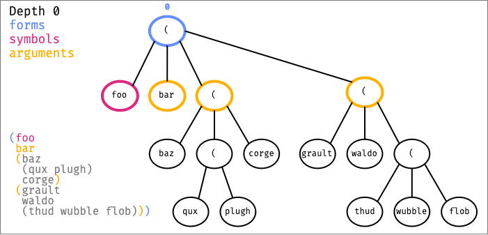

# cljfmt

[](https://travis-ci.org/weavejester/cljfmt)

cljfmt is a tool for formatting Clojure code [idiomatically][].

It can turn something like this:

```clojure
( let [x 3
    y 4]
  (+ (* x x
  )(* y y)
  ))
```

Into nicely formatted Clojure code like this:

```clojure
(let [x 3
      y 4]
  (+ (* x x) (* y y)))
```

However, it is not the goal of cljfmt to provide a canonical format.

[idiomatically]: https://github.com/bbatsov/clojure-style-guide

## Installation

The easiest way to get started with cljfmt is to add the lein-cljfmt
plugin to your [Leiningen][] project map:

```clojure
:plugins [[lein-cljfmt "0.7.0"]]
```

cljfmt has tested on Leiningen 2.5, but may not work on older
versions, particularly versions prior to Leiningen 2.4.

[leiningen]: https://github.com/technomancy/leiningen

## Usage

To check the formatting of your source files, use:

    lein cljfmt check

If the formatting of any source file is incorrect, a diff will be
supplied showing the problem, and what cljfmt thinks it should be.

If you want to check only a specific file, or several specific files,
you can do that, too:

    lein cljfmt check src/foo/core.clj

Once you've identified formatting issues, you can choose to ignore
them, fix them manually, or let cljfmt fix them with:

    lein cljfmt fix

As with the `check` task, you can choose to fix a specific file:

    lein cljfmt fix src/foo/core.clj

### deps.tools usage

It is possible to execute `cljfmt` using the
[Clojure CLI], without integrating with `lein`.

[Clojure CLI]: https://clojure.org/guides/deps_and_cli

```bash
clojure -Sdeps '{:deps {cljfmt {:mvn/version "0.6.4"}}}' \
  -m cljfmt.main [check|fix]
```

Customizing the rules is possible passing `edn` formated files,
using the same content used on lein profiles.

As example, with the following content to the `indentation.edn`
file, it is possible to customize the rules.

```clojure
{org.me/foo [[:inner 0]]}
```

```bash
clojure -Sdeps '{:deps {cljfmt {:mvn/version "0.6.4"}}}' \
  -m cljfmt.main check \
  --indents indentation.clj
```

## Editor Support

* [vim-cljfmt](https://github.com/venantius/vim-cljfmt)
* [CIDER 0.9+](https://github.com/clojure-emacs/cider)
* [Calva](https://github.com/BetterThanTomorrow/calva) (VS Code)
* [clojureVSCode](https://github.com/avli/clojureVSCode) (VS Code)

## Configuration

You can configure lein-cljfmt by adding a `:cljfmt` map to your
project:

```clojure
:cljfmt {}
```

cljfmt has several different formatting rules, and these can be
selectively enabled or disabled:

* `:indentation?` -
  true if cljfmt should correct the indentation of your code.
  Defaults to true.

* `:remove-surrounding-whitespace?` -
  true if cljfmt should remove whitespace surrounding inner
  forms. This will convert `(  foo  )` to `(foo)`.
  Defaults to true.

* `:remove-trailing-whitespace?` -
  true if cljfmt should remove trailing whitespace in lines. This will
  convert `(foo)   \n` to `(foo)\n`. Defaults to true.

* `:insert-missing-whitespace?` -
  true if cljfmt should insert whitespace missing from between
  elements. This will convert `(foo(bar))` to `(foo (bar))`.
  Defaults to true.

* `:remove-consecutive-blank-lines?` -
  true if cljfmt should collapse consecutive blank lines. This will
  convert `(foo)\n\n\n(bar)` to `(foo)\n\n(bar)`. Defaults to true.

* `:remove-multiple-non-indenting-spaces?` -
  true if cljfmt should remove multiple non indenting spaces. This
  will convert `{:a 1     :b 2}` to `{:a 1 :b 2}`. Defaults to false.

* `:split-keypairs-over-multiple-lines?` -
  true if cljfmt should break hashmaps onto multiple lines. This will
  convert `{:a 1 :b 2}` to `{:a 1\n:b 2}`. Defaults to false.

You can also configure the behavior of cljfmt:

* `:paths` - determines which directories to include in the
  scan. Arguments to `lein check` take precedence. If neither `:paths`
  nor command line arguments are given, cljfmt uses the lein project's
  `:source-paths` and `:test-paths`.

* `:file-pattern` -
  determines which files to scan, `#”\.clj[csx]?$”` by default.

* `:indents` -
  a map of var symbols to indentation rules, i.e. `{symbol [& rules]}`.
  See the next section for a detailed explanation.

  Unqualified symbols in the indents map will apply to any symbol with a
  matching "name" - so `foo` would apply to both `org.me/foo` and
  `com.them/foo`. If you want finer-grained control, you can use a fully
  qualified symbol in the indents map to configure indentation that
  applies only to `org.me/foo`:

  ```clojure
  :cljfmt {:indents {org.me/foo [[:inner 0]]}}
  ```

  Configured this way, `org.me/foo` will indent differently from
  `com.them/foo`.

  Note that `cljfmt` currently doesn't resolve symbols brought into a
  namespace using `:refer` or `:use` - they can only be controlled by an
  unqualified indent rule.

  As with Leiningen profiles, you can add metadata hints. If you want to
  override all existing indents, instead of just supplying new indents
  that are merged with the defaults, you can use the `:replace` hint:

  ```clojure
  :cljfmt {:indents ^:replace {#".*" [[:inner 0]]}}
  ```

* `:alias-map` -
  a map of namespace alias strings to fully qualified namespace
  names. This option is unnecessary in almost all cases, because
  `cljfmt` can compute the alias map from an `ns`
  declaration.

  However, it can't do that when used as a CLJS library,
  or when indenting something with no `ns` declaration like an EDN
  file. Even in those situations, you only need this option when using
  indentation rules that rely on the fully qualified symbol name.

  If you definitely need to configure this, it should look like this:

  ```clojure
  :cljfmt {:indents {org.me/foo [[:inner 0]]}
           :alias-map {"me" "org.me"}}
  ```

### Indentation rules

When we talk about how rules affect indentation of source code, we
refer to <code>(foo arg<sub>1</sub> arg<sub>2</sub>...
arg<sub>n</sub>)</code> as a form, `foo` as a form symbol, and
<code>arg<sub>1</sub> arg<sub>2</sub> ...  arg<sub>n</sub></code> as
form arguments.

The default indentation rules are encoded
[here](cljfmt/resources/cljfmt/).

Rules affect indentation of form arguments. A form argument is
eligible for indentation only when it is the first element on a line.

An indentation rule specifies an indentation type and indentation type
arguments. One or more rules can be applied to a form symbol.

Indentation types are:

* `:inner` -
  two character indentation applied to form arguments at a depth
  relative to a form symbo
  
* `:block` -
  first argument aligned indentation applied to form arguments at form
  depth 0 for a symbol

#### Form depth

A rule for depth n affects indentation of form arguments relative to
form symbol at depth n.

Form depth is the nested depth of any element within the form.

A contrived example will help to explain depth:

```clojure
(foo 
 bar
 (baz 
  (qux plugh)
  corge)
 (grault
  waldo
  (thud wubble flob)))
```

If we look at the example code as a tree, we can visualize the effect
of different form depths relative to `foo`:




#### Default behavior

In the absence of indentation rules:

```clojure
(foo bar                           (foo bar
baz            == formats to =>         baz
bang)                                   bang)
```

```clojure
(foo                               (foo
bar            == formats to =>     bar
bang)                               bang)
```

#### Inner rules

The `:inner` rule applies an indentation of two spaces to all eligible
form arguments of forms at a given form depth. It has 2 rule type
arguments:

* `form-depth` -
  apply inner indentation within forms at this depth

* `limit-to-form-index` -
  optionally limit indentation formatting to a single form, by default
  formatting is applied to all forms at `form-depth`

Indent rule:

```clojure
{foo [[:inner 0]]}
```

Will indent all arguments for symbol `foo` at depth `0` by two spaces:

```clojure
(foo bar                           (foo bar
baz            == formats to =>      baz
bang)                                bang)
```

Indent rule:

```clojure
{foo [[:inner 1]]}
```

Results in `:inner` indenting form arguments at depth `1`. Form
`(bang...)` is at depth `1` so its arguments are affected:

```clojure
(foo bar                           (foo bar
baz                                     baz
(bang          == formats to =>         (bang
quz                                       quz
qoz))                                     qoz))
```

Because no rule was specified for depth 0, default indentation is
applied to `bar` `baz` and `(bang...)`.

#### Limiting inner indentation

Sometimes it is useful to limit `:inner` indentation to one, rather
than all, forms at the specified depth. For example, we'd like `letfn`
to use inner indentation only in its binding vector.

Let's look at `letfn` example in the absence of any indentation rules:

```clojure
(letfn [(double [x]
                (* x 2))] ;; want inner indentation here
       (let [y (double 2)
             z (double 3)]
            (println y
                     z))) ;; but not here
```

Applying the rule:

```clojure
{letfn [[:inner 2]]}
```

Brings in the `letfn` function body to where we want it by affecting
form `(double [x]...)`:

```clojure
(letfn [(double [x]
          (* x 2))] ;; want inner indentation here
       (let [y (double 2)
             z (double 3)]
            (println y
              z))) ;; but not here
```

But also affects all other forms at depth `2`. In this case,
`(println...)` indentation is affected in an undesirable way. To limit
formatting to `(double [x]...)`, the `0`th form at depth `2`, the
`limit-to-form-index` rule type argument is added:

```clojure
{letfn [[:inner 2 0]]}
```

... giving us:
```clojure
(letfn [(double [x]
          (* x 2))] ;; want inner indentation here
       (let [y (double 2)
             z (double 3)]
            (println y
                     z))) ;; but not here
```

Remember that when calculating `limit-to-form-index`, all forms at the
specified depth are included, even self-evaluating ones. Given:

```clojure
(foo a b c
     (e f
        g)
     (h i
        j))
```

To affect inner indentation within form `(e...)` only, we use a rule
of:

```clojure
{foo [[:inner 1 3]]}
```

Which results in:

```clojure
(foo a b c
     (e f
       g)
     (h i
        j))
```

Because `(e...)` is the 4th (index `3`) at form depth `1`.

#### Block rules

The `:block` rule supports indenting to the first form argument. It
has a single rule type argument:

* `line-arg-count-threshold` -
  when there are more than this many form arguments on the same line
  as the form symbol, eligible form arguments on subsequent lines are
  indented to align with the first form argument. Otherwise, two space
  inner indentation is applied.

For indent rule:

```clojure
{foo [[:block 0]]}
```

The single argument `bar` on the same line as `foo` breaks the
threshold of `0` and indents eligible form arguments on subsequent
lines to `bar`:


```clojure
(foo bar                           (foo bar
baz            == formats to =>         baz
bang)                                   bang)
```

The two arguments `bar baz` on the same line as `foo` also breaks the
threshold of `0` and invokes indentation to the first argument:

```clojure
(foo bar baz   == formats to =>    (foo bar baz
bang)                                   bang)
```

No arguments on the same line as `foo` does not break the threshold of
`0`, so 2 space inner indentation is applied:

```clojure
(foo                               (foo
bar            == formats to =>      bar
baz                                  baz
bang)                                bang)
```

For indent rule:

```clojure
{foo [[:block 1]]}
```

The single arg `bar` on the same line as `foo` does not break the
threshold of `1` so we get inner indentation:

```clojure
(foo bar                           (foo bar
baz            == formats to =>      baz
bang)                                bang)
```

Two args `bar baz` on the same line as `foo` breaks the threshold of
`1` so we get first argument aligned indentation:

```clojure
(foo bar baz   == formats to =>    (foo bar baz
bang)                                   bang)
```

#### Multiple rules

Multiple rules can be specified. Picking up from our previous `letfn`
example, the rule:

```clojure
{letfn [[:inner 2 0]]}
```

Gave us:

```clojure
(letfn [(double [x]
          (* x 2))] ;; want inner indentation here
       (let [y (double 2)
             z (double 3)]
            (println y
                     z))) ;; but not here
```

Adding a `:block` rule:

```clojure
{letfn [[:block 1][:inner 2 0]]}
```

Matches the [current default rule for `letfn`][default-rule] and
results in indenting the `(let...` to where we want it:

```clojure
(letfn [(double [x]
          (* x 2))] ;; want inner indentation here
  (let [y (double 2)
        z (double 3)]
       (println y
                z))) ;; but not here
```

In this case, single form argument `[(double...)]` does not break the
`line-arg-count-threshold` of `1` and we therefore get inner
indentation for form argument `(let...)`.

[default-rule]: cljfmt/resources/cljfmt/indents/clojure.clj

## License

Copyright © 2020 James Reeves

Distributed under the Eclipse Public License either version 1.0 or (at
your option) any later version.
